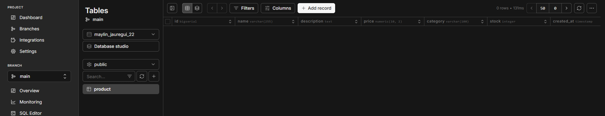
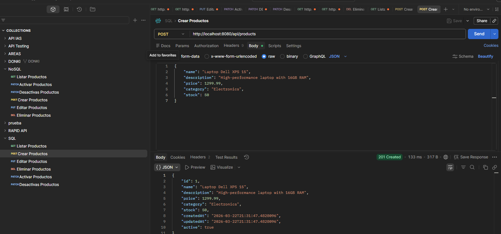
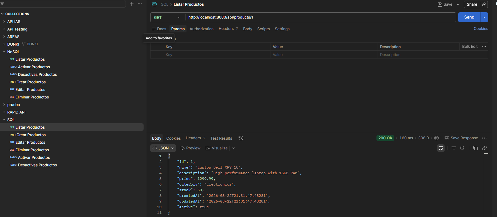
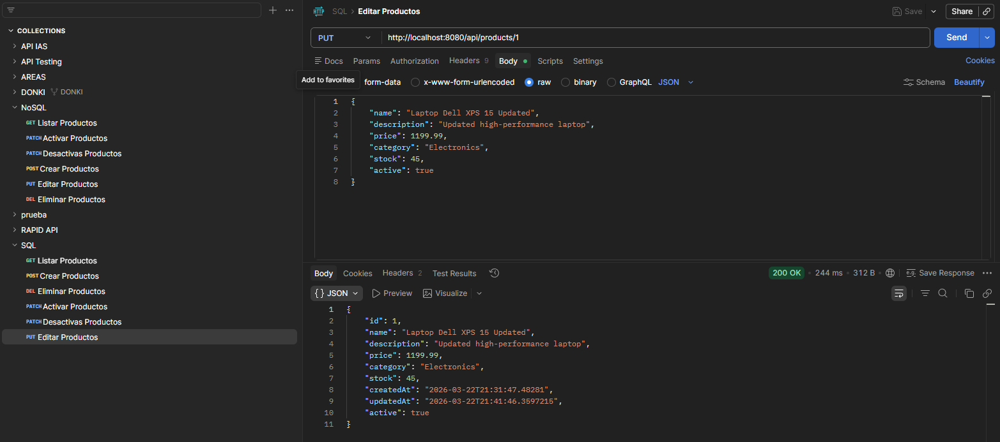
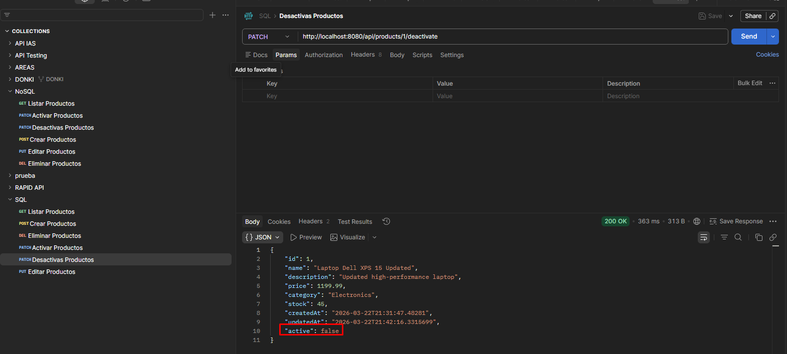
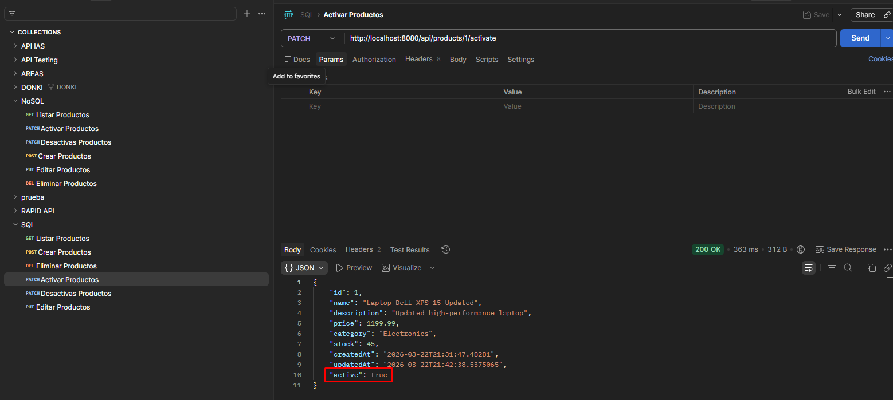
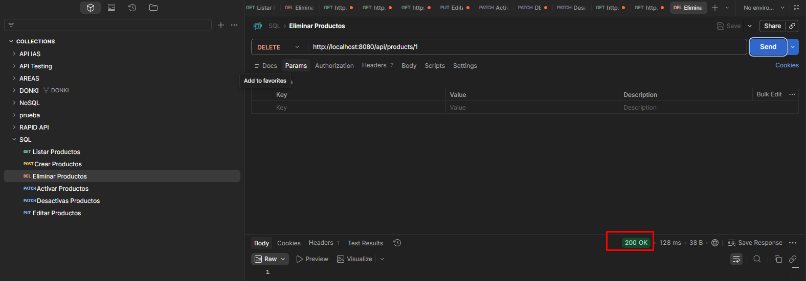
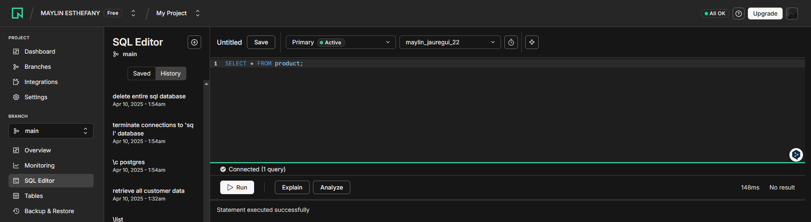
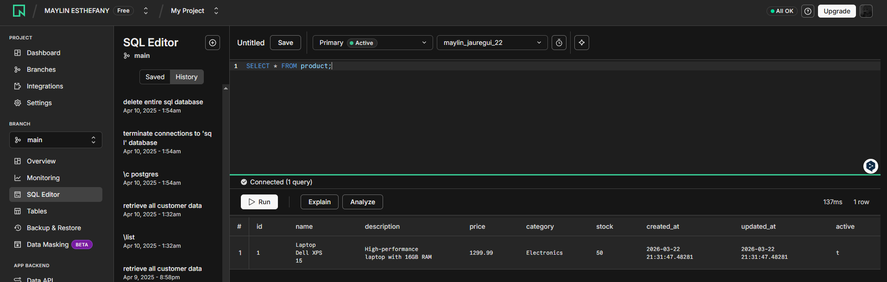

# Spring WebFlux + PostgreSQL (Neon) CRUD

Este proyecto implementa un CRUD reactivo utilizando Spring WebFlux y PostgreSQL (Neon) para la gestión de productos.

## Requisitos

- Java 17
- Maven
- PostgreSQL (Neon) database
- Git

## Configuración

1. **Clonar el repositorio:**
   ```bash
   git clone <repository-url>
   cd spring-weblux-sql
   git checkout develop
   ```

2. **Configurar PostgreSQL Neon:**
   - Crear una base de datos llamada `maylin_jauregui_22`
   - Crear una tabla llamada `product` usando el script `src/main/resources/schema.sql`
   - Obtener la cadena de conexión desde Neon.tech
   - Actualizar el archivo `src/main/resources/application.yaml` con tus credenciales:
   ```yaml
   spring:
     r2dbc:
       url: r2dbc:postgresql://ep-odd-grass-a5zs4hqj-pooler.us-east-2.aws.neon.tech/maylin_jauregui_22?sslmode=require&channel_binding=require
       username: NeonDB_owner
       password: npg_z3LUOmRcrI5G
   ```

3. **Compilar y ejecutar:**
   ```bash
   mvn clean install
   mvn spring-boot:run
   ```

## Creación de Tabla en PostgreSQL Neon

Antes de probar la API, es necesario crear la tabla `product` en la base de datos Neon:

### 1. Conectarse a Neon.tech
- Iniciar sesión en [Neon Console](https://console.neon.tech/)
- Seleccionar el proyecto y la base de datos `maylin_jauregui_22`

### 2. Ejecutar Script SQL
En el SQL Editor de Neon, ejecutar el contenido del archivo `src/main/resources/schema.sql`:

```sql
CREATE TABLE IF NOT EXISTS product (
    id BIGSERIAL PRIMARY KEY,
    name VARCHAR(255) NOT NULL,
    description TEXT,
    price DECIMAL(10,2) NOT NULL,
    category VARCHAR(100),
    stock INTEGER DEFAULT 0,
    created_at TIMESTAMP DEFAULT CURRENT_TIMESTAMP,
    updated_at TIMESTAMP DEFAULT CURRENT_TIMESTAMP,
    active BOOLEAN DEFAULT true
);

-- Opcional: Crear un trigger para actualizar updated_at automáticamente
CREATE OR REPLACE FUNCTION update_updated_at_column()
RETURNS TRIGGER AS $$
BEGIN
    NEW.updated_at = CURRENT_TIMESTAMP;
    RETURN NEW;
END;
$$ language 'plpgsql';

CREATE TRIGGER update_product_updated_at 
    BEFORE UPDATE ON product 
    FOR EACH ROW 
    EXECUTE FUNCTION update_updated_at_column();
```

### 3. Verificar Creación
```sql
SELECT * FROM product;
```
**Resultado esperado:** Tabla vacía con estructura correcta



## Endpoints de la API

La aplicación estará disponible en `http://localhost:8080`

### Documentación Swagger/OpenAPI
- Swagger UI: `http://localhost:8080/swagger-ui.html`
- OpenAPI JSON: `http://localhost:8080/api-docs`

### Endpoints CRUD

| Método | Endpoint | Descripción |
|--------|----------|-------------|
| POST | `/api/products` | Crear un nuevo producto (ID auto-incremental) |
| GET | `/api/products/{id}` | Obtener producto por ID |
| GET | `/api/products` | Obtener todos los productos |
| PUT | `/api/products/{id}` | Actualizar producto existente |
| DELETE | `/api/products/{id}` | Eliminar producto |

### Endpoints de Activación/Desactivación

| Método | Endpoint | Descripción |
|--------|----------|-------------|
| PATCH | `/api/products/{id}/activate` | Activar producto (active: true) |
| PATCH | `/api/products/{id}/deactivate` | Desactivar producto (active: false) |

### Endpoints de Búsqueda

| Método | Endpoint | Descripción |
|--------|----------|-------------|
| GET | `/api/products/search/name?name=` | Buscar productos por nombre |
| GET | `/api/products/search/category?category=` | Filtrar por categoría |
| GET | `/api/products/search/price-range?min=&max=` | Filtrar por rango de precios |
| GET | `/api/products/active` | Obtener productos activos |
| GET | `/api/products/in-stock` | Obtener productos con stock |

## Modelo de Datos

El modelo `Product` contiene los siguientes campos:
- `id`: Identificador único auto-incremental (Long) - Ej: 1, 2, 3
- `name`: Nombre del producto (String)
- `description`: Descripción detallada (String)
- `price`: Precio (BigDecimal)
- `category`: Categoría (String)
- `stock`: Cantidad disponible (Integer)
- `createdAt`: Fecha de creación (LocalDateTime)
- `updatedAt`: Fecha de actualización (LocalDateTime)
- `active`: Estado activo (Boolean)

## Tecnologías Utilizadas

- **Spring Boot 3.5.11**
- **Spring WebFlux** - Programación reactiva
- **Spring Data R2DBC** - Acceso reactivo a bases de datos relacionales
- **PostgreSQL (Neon)** - Base de datos SQL en la nube
- **Lombok** - Reducción de código boilerplate
- **SpringDoc OpenAPI** - Documentación automática de API
- **Maven** - Gestión de dependencias

## Estructura del Proyecto

```
src/main/java/ap1/maylin/jauregui/
├── model/          # Entidades de datos
│   └── Product.java
├── repository/     # Interfaces de acceso a datos
├── service/        # Interfaces de lógica de negocio
├── impl/           # Implementaciones de servicios
├── rest/           # Controladores REST
├── config/         # Configuraciones
│   └── DatabaseConfig.java
└── Application.java # Clase principal
```

## Testing

Para probar los endpoints puedes usar:

**Swagger UI**: Navega a `http://localhost:8080/swagger-ui.html`


## Pruebas en Postman

### Configuración inicial
1. **Content-Type**: `application/json`
2. **Base URL**: `http://localhost:8080/api/products`

### Operaciones CRUD

#### 1. Crear Producto
```
POST http://localhost:8080/api/products
Content-Type: application/json

{
    "name": "Laptop Dell XPS 15",
    "description": "High-performance laptop with 16GB RAM",
    "price": 1299.99,
    "category": "Electronics",
    "stock": 50
}
```
**Respuesta esperada:** Producto creado con ID 1




#### 2. Obtener Producto por ID
```
GET http://localhost:8080/api/products/1
```
**Respuesta esperada:** Producto con ID 1



#### 3. Actualizar Producto
```
PUT http://localhost:8080/api/products/1
Content-Type: application/json

{
    "name": "Laptop Dell XPS 15 Updated",
    "description": "Updated high-performance laptop",
    "price": 1199.99,
    "category": "Electronics",
    "stock": 45,
    "active": true
}
```
**Respuesta esperada:** Producto actualizado



### Operaciones de Activación

#### 4. Desactivar Producto
```
PATCH http://localhost:8080/api/products/1/deactivate
```
**Respuesta esperada:** Producto con `active: false`



#### 5. Activar Producto
```
PATCH http://localhost:8080/api/products/1/activate
```
**Respuesta esperada:** Producto con `active: true`



#### 6. Eliminar Producto
```
DELETE http://localhost:8080/api/products/1
```
**Respuesta esperada:** 204 No Content




**Verificación:** Como se observa en la imagen, el producto con ID 1 ha sido eliminado correctamente.




## Verificación en PostgreSQL Neon

### Listar Productos en PostgreSQL

Para verificar que los productos se guardan correctamente en PostgreSQL Neon:

1. **Conectarse a Neon.tech**
2. **Seleccionar la base de datos:** `maylin_jauregui_22`
3. **Ejecutar consulta SQL:**
   ```sql
   SELECT * FROM product;
   ```

**Resultado esperado:** Lista de todos los productos almacenados en la tabla product



## Notas Importantes

- Asegúrate de configurar correctamente las credenciales de PostgreSQL Neon
- La base de datos debe llamarse `maylin_jauregui_22`
- La tabla debe llamarse `product` (crear con `schema.sql`)
- El proyecto usa programación reactiva con WebFlux y R2DBC
- Los IDs son auto-incrementales (BIGSERIAL) gestionados por PostgreSQL
